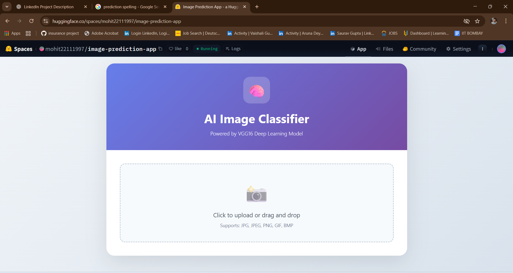
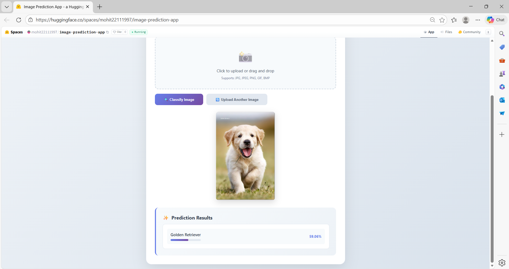

<h1 align="center">AI Image Classification (CNN + VGG16)</h1>


A production-ready **Deep Learning–based Image Classification application** built using **Flask** and a **pre-trained VGG16 Convolutional Neural Network**. The application allows users to upload an image and receive real-time classification results with confidence scores. The project is deployed on **Hugging Face Spaces** and demonstrates end-to-end ML application development.

---

## 🔗 Live Demo
👉 **Deployed on Hugging Face Spaces** https://huggingface.co/spaces/mohit22111997/image-prediction-app

## 🚀 YouTube video Link
👉 Click on Thumbnail [](https://www.youtube.com/watch?v=B3rEahTkDI0)


---

## 🤖 Project Overview
This project showcases how a pre-trained deep learning model can be integrated into a user-friendly web application. It focuses on:
- Applying **transfer learning** using VGG16 trained on ImageNet dataset.
- Building a lightweight **Flask-based inference API**
- Designing an interactive frontend without external frameworks
- Deploying an ML application using **Docker** on Hugging Face Spaces

The goal is to built an end-to-end deep learning classification application.

---

## 🧠 Model Details
- **Architecture:** VGG16 (Convolutional Neural Network)
- **Dataset:** ImageNet (pre-trained weights)
- **Input Size:** 224 × 224 RGB images
- **Output:** Top predicted class with confidence score
- **Framework:** TensorFlow / Keras

---

## ⚙️ Tech Stack
**Backend & ML**
- Python
- Flask
- TensorFlow (Keras)
- NumPy

**Frontend**
- HTML5
- CSS3
- JavaScript

**Deployment & DevOps**
- Docker
- Hugging Face Spaces

---

## 🏷️ Screenshots

### AI Image Classification Home Page



### Upload Image


### Classification Page



## ⭐ Key Features
- Upload images via **drag-and-drop** or file selection
- Real-time image classification
- Confidence score visualization
- Secure file handling and validation
- RESTful prediction endpoint (`/predict`)
- Responsive and clean UI

---

## 🏗️ Project Structure
```
├── app.py              # Main Flask application and ML inference logic
├── Screenshots/              # Application Screenshots folder
├── requirements.txt    # Python dependencies
├── Dockerfile          # Container configuration for deployment
├── uploads/             # Temporary image storage (auto-created)
└── README.md            # Project documentation
```

---

## 🖥️ Local Setup & Installation

### 1️⃣ Clone the Repository
```bash
https://github.com/mohitkumarsahu/Image_Prediction_Application.git
cd Image_Prediction_Application
```

### 2️⃣ Create Virtual Environment
```bash
python -m venv venv
source venv/bin/activate
```

### 3️⃣ Install Dependencies
```bash
pip install -r requirements.txt
```

### 4️⃣ Run the Application
```bash
python app.py
```

The app will be available at:
```
http://localhost:7860
```

---

## 🐳 Docker Support
This project includes a Dockerfile for easy deployment.

```bash
docker build -t ai-image-classifier .
docker run -p 7860:7860 ai-image-classifier
```

---

## 🔍 API Endpoint

### POST `/predict`
- **Input:** Image file 
- **Output:** JSON response with predicted label and confidence score

Example response:
```json
{
  "predictions": [
    {
      "label": "golden_retriever",
      "confidence": 0.92
    }
  ]
}
```

---

## 🎯 Learning Outcomes
- Implemented **end-to-end ML inference pipeline**
- Integrated a deep learning model (VGG16) into a production web app
- Gained hands-on experience with **model deployment** on HuggingFace Spaces
- Improved understanding of **Flask APIs and Docker**
- Practiced clean code organization and documentation

---

## 📈 Future Improvements
- Add top-3 predictions
- Fine tune model on particular usecases
- Add user authentication
- Image augumentation for better performance optimization

---

## 👤 Author
**Mohit Kumar Sahu**  
Aspiring **AI/ML Engineer** | Entry-Level Developer  
Focused on building practical,optimized & deployable AI_ML solutions

---

## 📜 License
This project is for educational and portfolio purposes.

---

⭐ *If you find this project useful, feel free to star the repository!*


